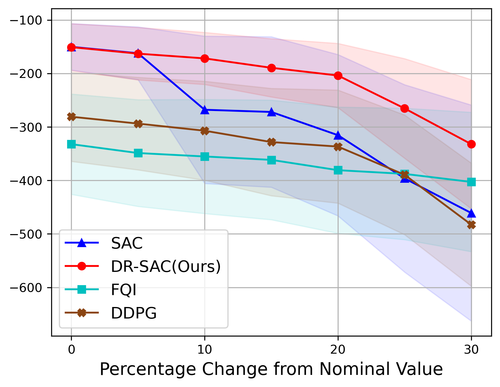
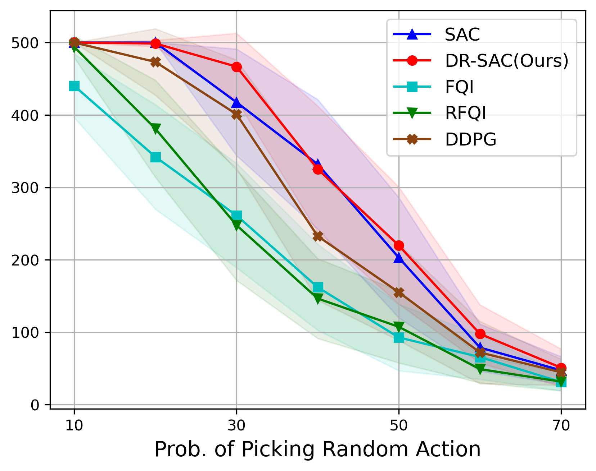
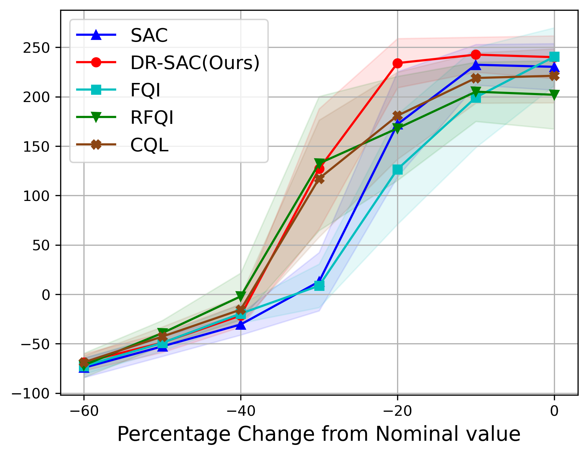
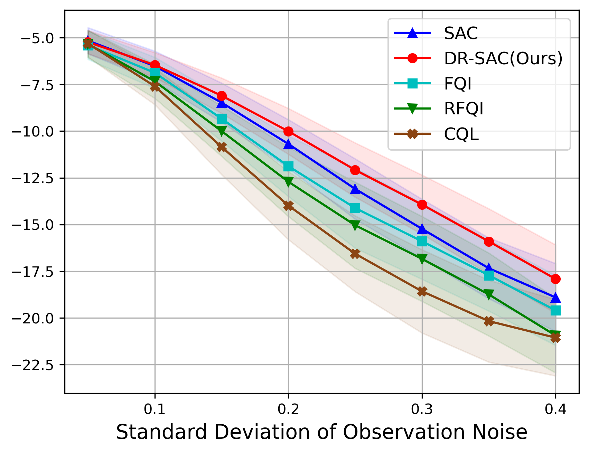
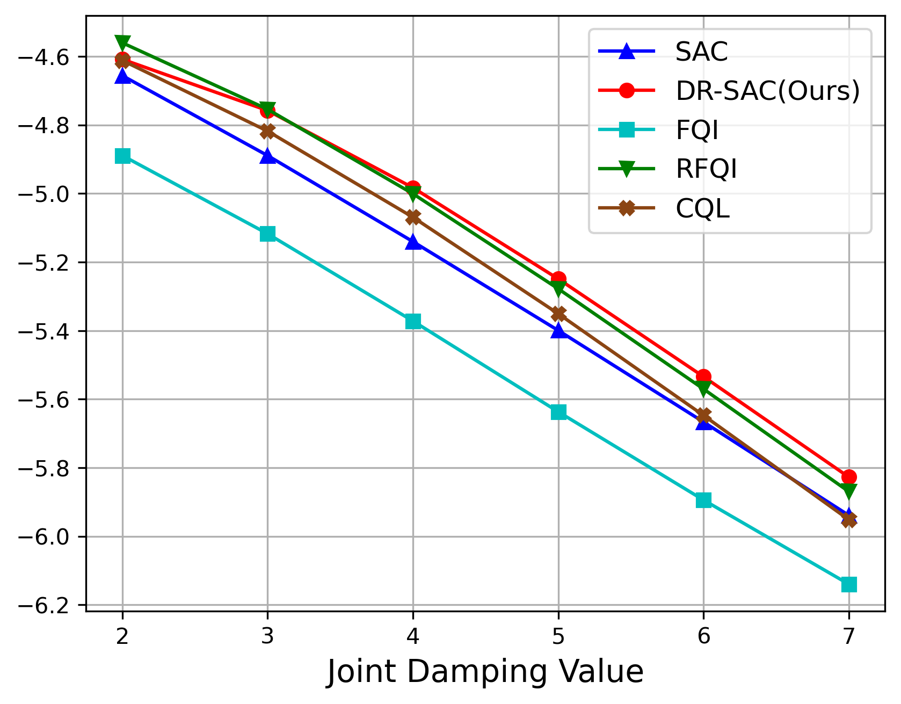
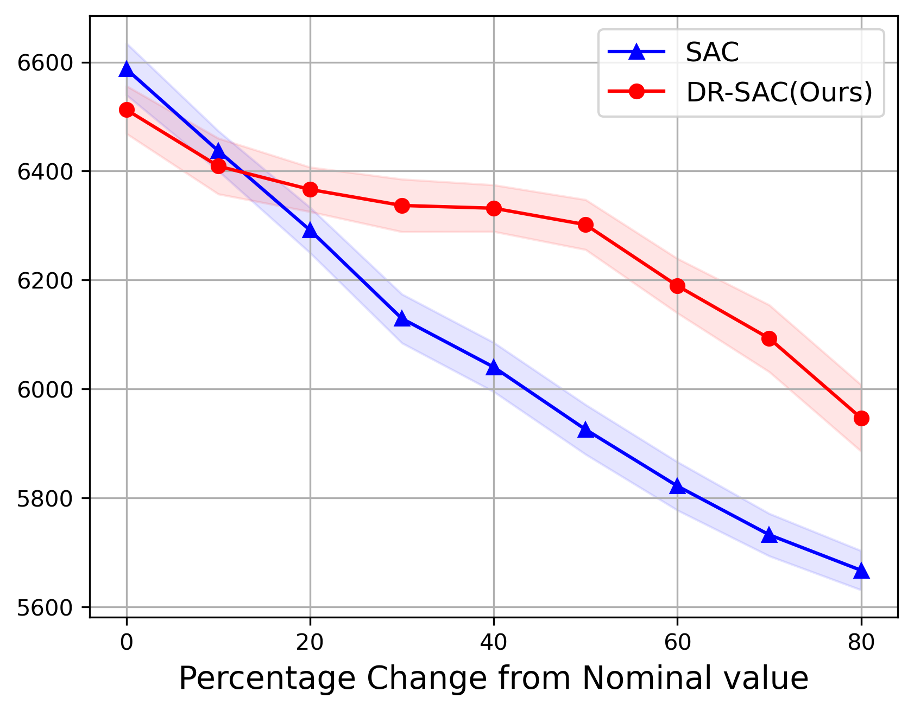

# DR-SAC

This repository provides an implementation of **Distributionally Robust Soft Actor-Critic (DR-SAC)** (ICLR 2026).

## Paper links

- **OpenReview**: `https://openreview.net/forum?id=a19MA0ksbc`
- **arXiv**: `https://arxiv.org/abs/2506.12622`

## Introduction
Deep reinforcement learning (RL) policies can perform well in controlled settings, but they often degrade under distribution shifts and environmental uncertainty. This is particularly challenging in offline learning settings, where the agent only has access to logged data from a nominal dynamics model.

Distributionally robust RL (DR-RL) addresses this by optimizing for the worst-case transition dynamics within an uncertainty set. Prior DR-RL work is largely limited to value-based methods in tabular settings, leaving a gap for actor–critic methods in continuous-action offline RL.

This repository provides an implementation of **DR-SAC: Distributionally Robust Soft Actor-Critic for Reinforcement Learning under Uncertainty** (ICLR 2026). Key contributions include:
- A **distributionally robust** variant of soft actor-critic (SAC) that optimizes entropy-regularized rewards against **worst-case transition models** under a **KL-divergence constrained uncertainty set**.
- A **functional optimization approach** to balance the effectiveness and efficiency of the robust target construction.
- A **generative modeling** approach to estimate the nominal transition dynamics and resolve the double-sampling issue.


## Algorithm Intuition
At a high level, DR-SAC modifies standard SAC by replacing the nominal target with a **distributionally robust** target.

Intuition:
1. **Robust objective**: instead of trusting a single transition model, DR-SAC considers the **worst-case** transition dynamics inside a KL-constrained uncertainty set. Specifically, the distributionally robust Bellman operator is defined as:
$$\begin{aligned}
\mathcal{T}_{\delta}^{\pi} Q(s,a) =& \mathbb{E}[r] + \gamma\cdot 
\inf_{p_{s,a}\in\mathcal{P}_{s,a}(\delta)} \mathbb{E}_{p_{s,a}} [V(s')]\quad & \text{(primal form)} \\
=& \mathbb{E}[r] + \gamma\cdot 
\sup_{\beta\ge0} \left\{-\beta\cdot\log\left(\mathbb{E}_{p_{s,a}^0} \left[\text{exp}\left(-\frac{V(s')}{\beta}\right)\right]\right) \right\}\quad & \text{(dual form)}
\end{aligned}$$
where $\mathcal{P}_{s,a}(\delta)$ is the KL-divergence ball centered at the nominal transition model $p_{s,a}^0$ with radius $\delta$, and value function is 
$$
V(s) = \mathbb{E}_{a\sim\pi}[Q(s,a) - \alpha \cdot\log \pi(a | s)].
$$

2. **Functional optimization**: we replace the per-(s,a) scalar optimization with a shared optimization problem over a function space, which better balances effectiveness and efficiency of the robust target construction.

3. **Generative modeling**: the algorithm incorporates generative models to estimate the unknown transition dynamics in offline settings, resolving the double-sampling issue that arises under non-linear objectives when the ambiguity set is defined by KL-divergence.

## Setup

Install required dependencies:

```
conda env create -f requirements.yaml -n DRSAC
conda activate DRSAC
```

## Running the Code

### Basic Training

Train with the default configuration (Pendulum, SAC) in offline learning settings. Provide the offline dataset location via `data_path` (set it to `YOUR_DATA_PATH`). All models are trained in the nominal (unperturbed) environment.

```
python train_sac.py data_path="YOUR_DATA_PATH"
```

### Changing Environments

Train on a different environment:

```
python train_sac.py env/sac=lunarlander data_path="YOUR_DATA_PATH"
```

Available environments:

* `pendulum` (default)
* `cartpole`
* `lunarlander`
* `halfcheetah`
* `reacher`

### Using Robust Policy

Train with robust policy (DR-SAC):

```
python train_sac.py robust=true data_path="YOUR_DATA_PATH"
```

### Changing Hyperparameters

Change any hyperparameter directly from command line:

```
python train_sac.py batch_size=512 a_lr=0.001 hid_dim=[128,128] data_path="YOUR_DATA_PATH"
```

### Evaluation Mode

Run in evaluation mode (load the model from `YOUR_MODEL_PATH`):

```
python train_sac.py eval_model=true load_model=true load_path="YOUR_MODEL_PATH"
```

### Adding Noise

Enable environment modifications via `config/env_mods.yaml`. For example, enable observation noise:

```
python train_sac.py \
    eval_model=true load_model=true load_path="YOUR_MODEL_PATH" \ # standard evaluation mode
    env_mods.use_mods=true \                                      # enable environment modifications
    env_mods.observation_noise.enabled=true \                     # enable observation noise
    env_mods.observation_noise.type=gaussian \                    # type of noise, can be gaussian, cauchy, adversarial, etc.  
    env_mods.observation_noise.noise_level=0.1 \                  # noise level; for gaussian noise, this is the standard deviation
```
We include the following environment modifications (not exhaustive):

| Environment | Modifications | Description |
|---|---|---|
| General | `observation_noise` | Noise added to the nominal observation. Noise distribution includes `gaussian`, `cauchy`, `adversarial`, etc. |
|          | `action_perturb` | Actuators choose random actions with probability `action_perturb.probability`. |
| Pendulum | `mass_factor` | Factor to multiply the pendulum mass by. |
| CartPole | `force_mag_factor` | Factor to multiply the CartPole force magnitude by. |
| LunarLander | `wind_power` | Constant wind force when the lander approaches the ground. |
|          | `turbulence_power` | Random turbulence level when the lander approaches the ground. |
| HalfCheetah | `back_stiff` / `front_stiff` | Back/front stiffness factor. |
|          | `back_damping` / `front_damping` | Back/front damping factor. |
| Reacher | `joint0_stiff` / `joint1_stiff` | Joint stiffness factors. |

### Multirun with Different Configurations

Run multiple configurations in parallel:

```
python train_sac.py --multirun env/sac=pendulum,lunarlander robust=true,false
```

This will run 4 experiments with all combinations of environments and robust settings.

## Configuration Structure

### Main Configuration

The main configuration file for SAC is `config/sac_config.yaml`.

### Environment Configurations

Environment-specific configurations are stored under `config/env/`. They define:

* Environment name and index
* Recommended training steps

## Results
 
<table>
  <tr>
    <td align="center">
      
      <div><b>Pendulum, Length</b></div>
    </td>
    <td align="center">
      
      <div><b>CartPole, Action</b></div>
    </td>
    <td align="center">
      
      <div><b>LunarLander, Engine</b></div>
    </td>
  </tr>
  <tr>
    <td align="center">
      
      <div><b>Reacher, Observation Noise</b></div>
    </td>
    <td align="center">
      
      <div><b>Reacher, Damping</b></div>
    </td>
    <td align="center">
      
      <div><b>HalfCheetah, Back Damping</b></div>
    </td>
  </tr>
</table>

<p> The curves show the average reward over 50 episodes, with shaded regions indicating 0.5 standard deviation. Environmental perturbations include parameter shifts, state and actuator noise.</p>


## Ablations

### Training Efficiency of DR-SAC
- In DR-SAC, we replace the per-$(s,a)$ scalar optimization with a shared optimization problem over a function space. This functional approach achieves comparable robustness to the separate approach while requiring less than $2\%$ of the training time.

### Selection of Generative Model
- DR-SAC is largely insensitive to the VAE modeling choices. On Pendulum, varying the VAE latent dimension between 5 and 20 does not noticeably degrade robustness, and DR-SAC consistently outperforms the SAC baseline.
- We also evaluate alternative generative transition models in DR-SAC, including diffusion and flow-based variants. The diffusion-based model achieves comparable robustness but requires at least $4.5\times$ the training time of the VAE-based model. Flow-based models show less stable performance, even on unperturbed Pendulum.

## Dataset and Selected Models

```
wget -O ./models/models.zip "https://uofi.box.com/s/9bfnbhexghgv6xbfmu4rj946ng9sv9oa"
echo "Unzipping models..."
unzip ./models/models.zip -d ./models/selected_models

wget -O ./data/datasets.zip "https://uofi.box.com/s/3qzfdtm5wx2lwckam9es0aptep58tc6d"
echo "Unzipping datasets..."
unzip ./datasets/datasets.zip -d ./datasets
```

## Output Structure

When running with Hydra:

* Logs, configs, and outputs are saved to `outputs/SAC/YYYY-MM-DD/HH-MM-SS/`
* For multirun experiments, outputs are saved to `multirun/SAC/YYYY-MM-DD/HH-MM-SS/`
* TensorBoard logs are in the `tensorboard/` subdirectory
* Models are saved to `models/SAC_model/{ENV_NAME}/`

## Advanced Usage

### Adding New Environments

To add a new environment:

1. Create a YAML file in `config/env/sac/`
2. Define environment parameters (name, index, training steps)
3. Update the environment lists in `train_sac.py` if needed

### Creating Custom Configuration Groups

You can create custom configuration groups for different experiments:

1. Create a directory in `config/` (e.g., `config/experiment/`)
2. Add YAML files with different configurations
3. Run with: `python train_sac.py +experiment=my_config`

### Citation

```
@inproceedings{
  cui2026drsac,
  title={{DR}-{SAC}: Distributionally Robust Soft Actor-Critic for Reinforcement Learning under Uncertainty},
  author={Mingxuan Cui and Duo Zhou and Yuxuan Han and Grani A. Hanasusanto and Qiong Wang and Huan Zhang and Zhengyuan Zhou},
  booktitle={The Fourteenth International Conference on Learning Representations},
  year={2026},
  url={https://openreview.net/forum?id=a19MA0ksbc}
}
```
